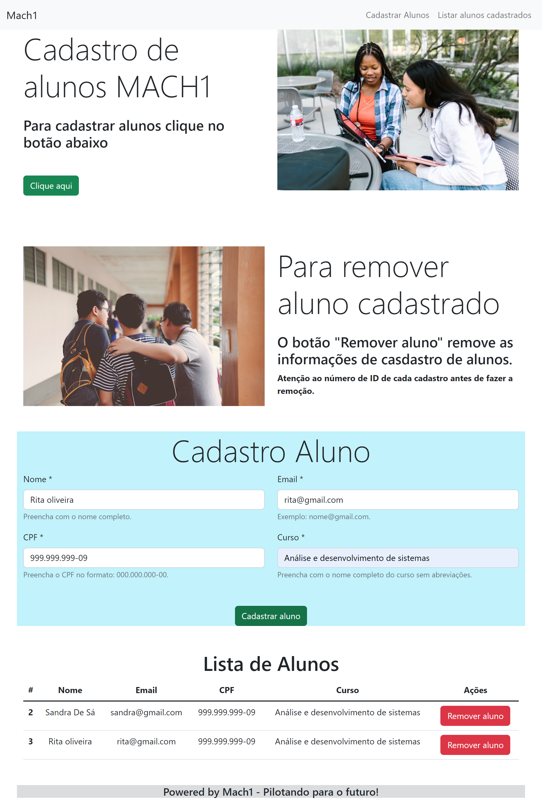

# Página de cadastro de alunos 

Comecei fazendo esse [projeto usando o HTML estático](https://github.com/anjinha-oliveira/cadastro-de-alunos).
## Página web
Nessa página tem cabeçalho, título, botão para descer até o formulário. 
No formulário temos campos para preenchimento e botão para adicionar
os dados de alunos e exibi-los na tabela de listagem de alunos.

Utilizei React como biblioteca front-end para criar a página onde os alunos apareçam em tempo real na tabela. 




## Como instalar

Para instalar o REACT na minha máquina, usei o seguinte comando: 

```sh

$ npm install 

```

## Como execultar 

```sh
$ npm start

```
